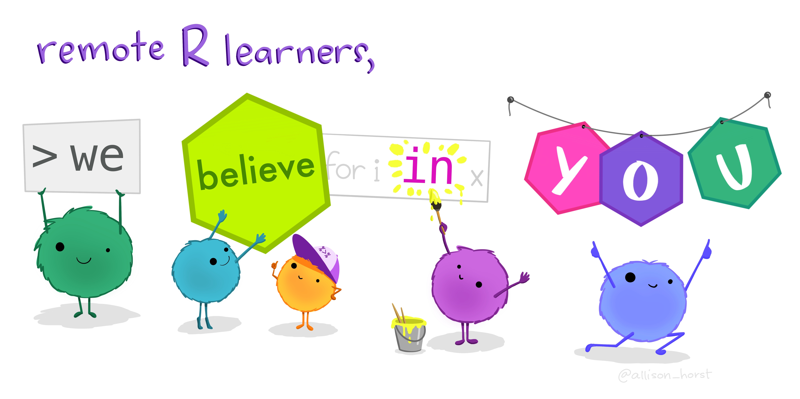

# `codeswitchR`: Code switching in R

This `README` is an attempt to collate a list of packages that may be
helpful for (self-)teaching new programming languages or different
workflows in R. These packages provide a way to convert what one
**knows** and what one may wish to **learn**.

Needless to say, none of the packages can help you *fully* learn a new
programming language, but the idea is to have a starting point that is
**familiar** and **comfortable**, which would hopefully minimize the
chances that you just give up in the early phase when the learning curve
is steep.

<!-- 
 -->

Illustration by [Allison
Horst](https://github.com/allisonhorst/stats-illustrations) - CC BY 4.0
<!-- 
 -->

# Improving this document

This is in no way a complete list and I would appreciate if more
resources are added. Feel free to make [pull
requests](https://github.com/IndrajeetPatil/codeswitchR) to improve this
document, either by adding more examples or improving on the existing
ones. 😊

In case you were wondering, the images of source code have been prepared
using [carbon](https://carbon.now.sh/).

# Switch it up 🔀

| What you know  | What you’re learning   | Switch 📦                                                                                                 | Examples                                   |
|----------------|------------------------|-----------------------------------------------------------------------------------------------------------|--------------------------------------------|
| `dplyr`        | `data.table`           | [`dtplyr`](https://dtplyr.tidyverse.org/articles/translation.html)                                        | <!-- --> |
| `dplyr`        | `SQL`                  | [`dbplyr`](https://dbplyr.tidyverse.org/articles/sql.html)                                                | <!-- -->       |
| `SQL`          | `dplyr`                | [`tidyquery`](https://github.com/ianmcook/tidyquery/blob/master/README.md)                                | <!-- -->       |
| `LaTeX`        | `R`/`plotmath`         | [`latex2exp`](https://cran.r-project.org/web/packages/latex2exp/vignettes/using-latex2exp.html)           | <!-- -->  |
| `R`/`plotmath` | `LaTeX`                | [`simsalapar`](https://rstudio-pubs-static.s3.amazonaws.com/268872_483cb8ee959642b68e9cf2b84eda1e06.html) | <!-- -->  |
| `markdown`     | `LaTeX`, `HTML`, `xml` | [`commonmark`](https://github.com/r-lib/commonmark)                                                       | <!-- -->   |
| `R`            | `JSON`                 | [`jsonlite`](https://cran.r-project.org/web/packages/jsonlite/vignettes/json-mapping.pdf)                 | <!-- -->          |
| `R`            | `HTML`                 | [`htmltools`](https://rstudio.github.io/htmltools/)                                                       | <!-- -->          |
| `R`            | `YAML`                 | [`ymlthis`](https://ymlthis.r-lib.org/index.html)                                                         | <!-- -->           |
