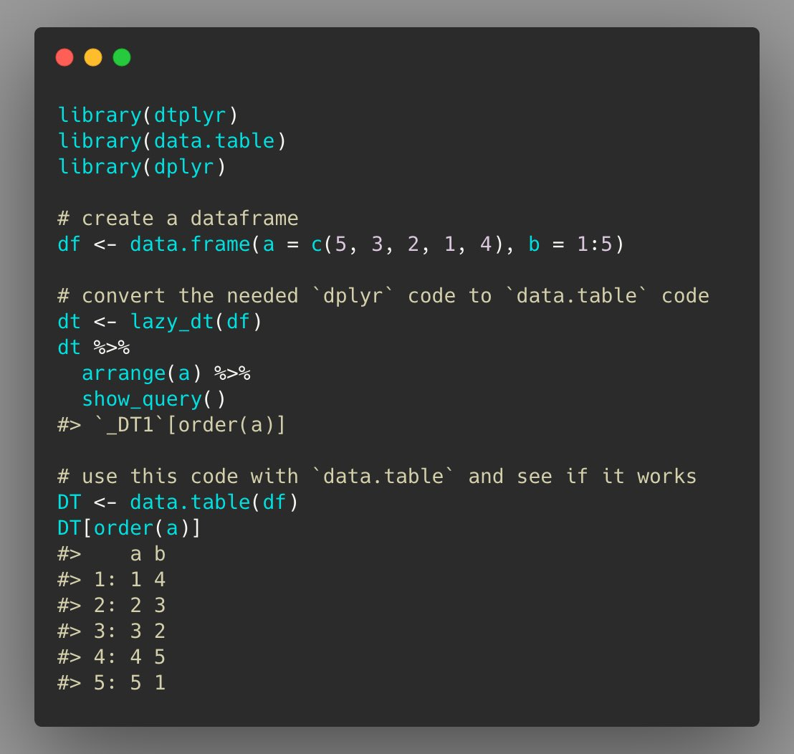
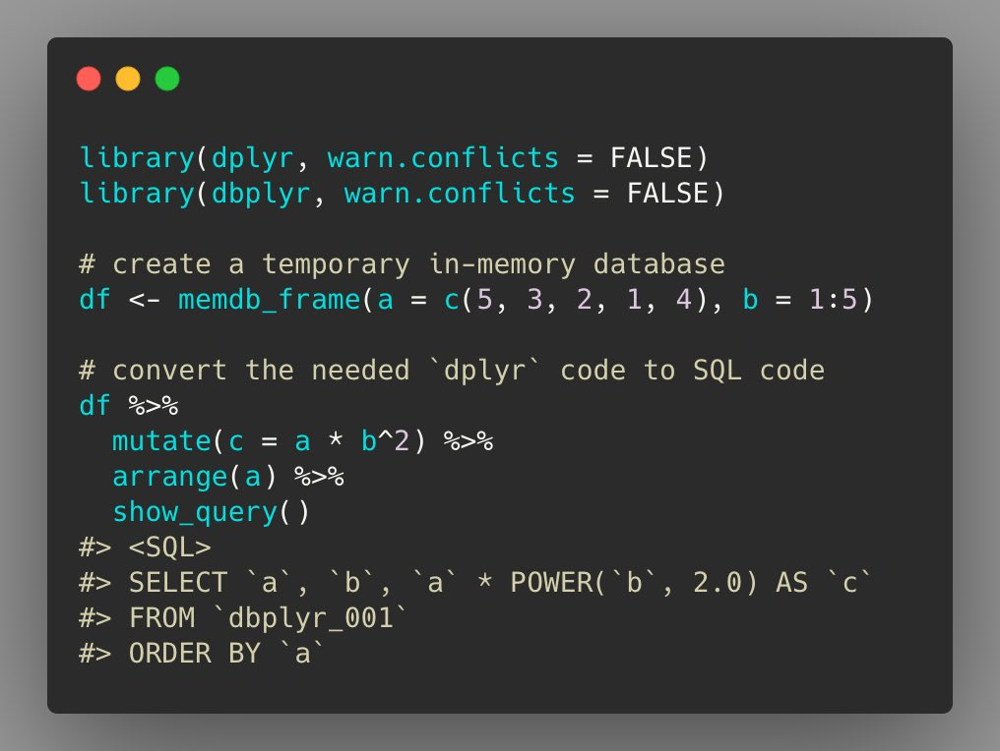
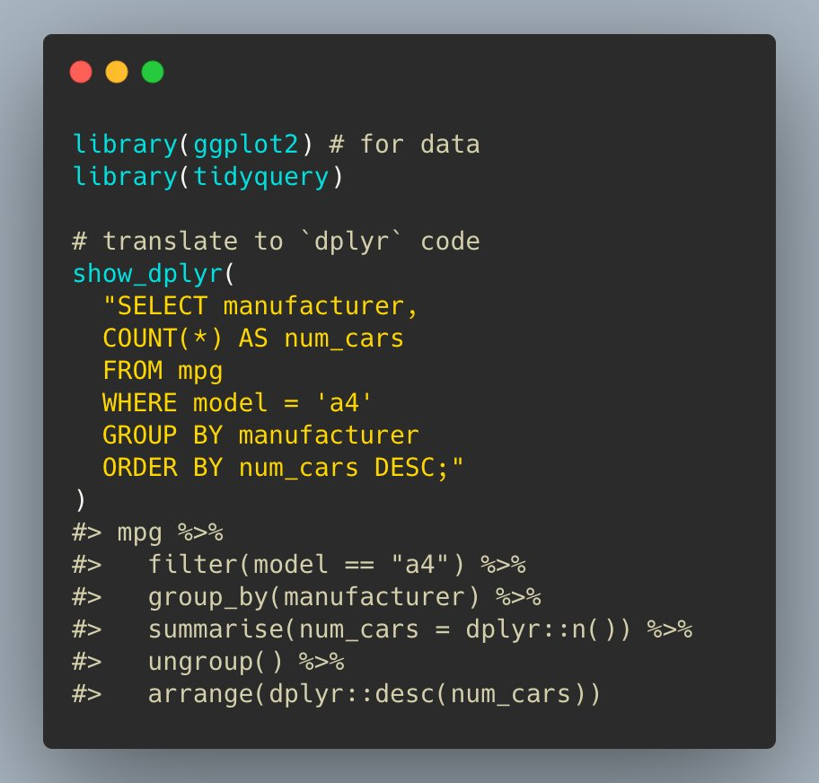
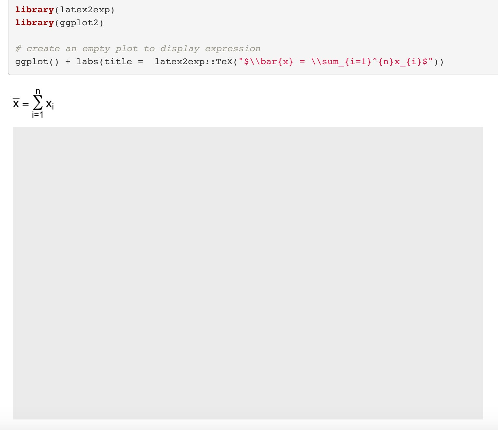
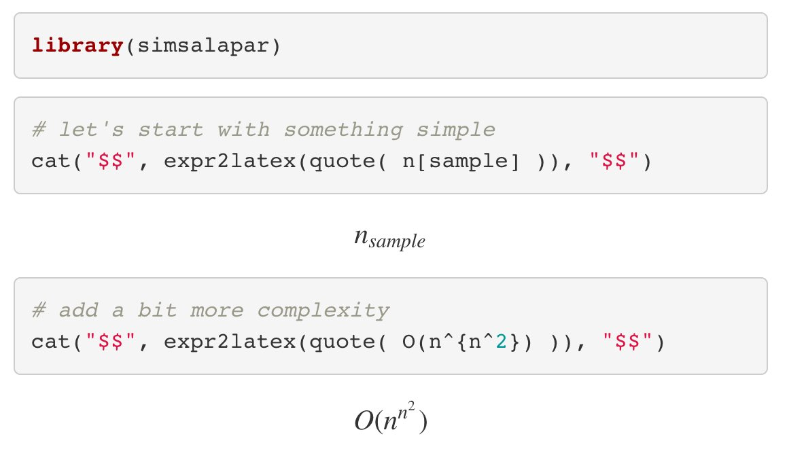
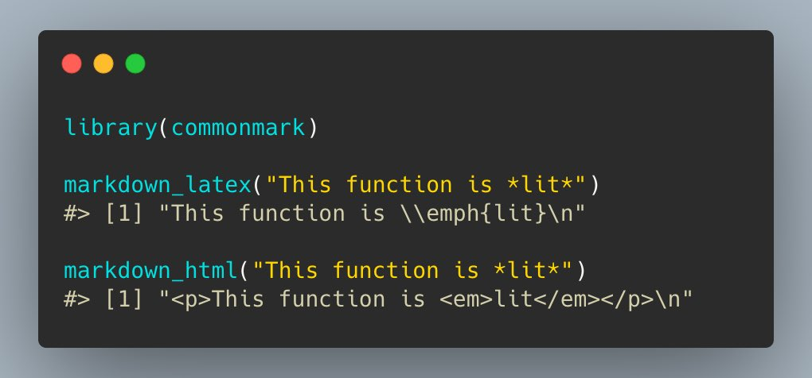
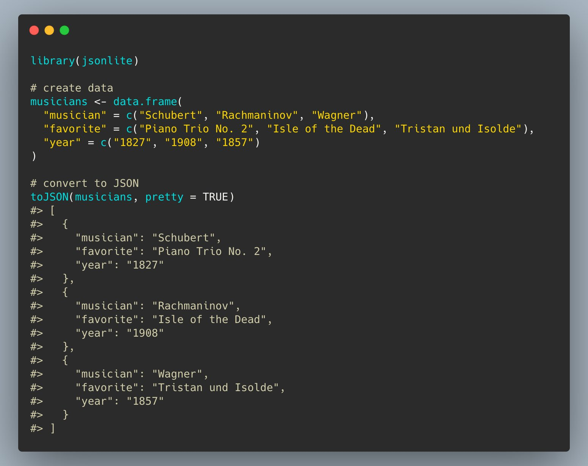
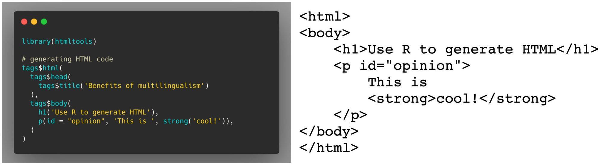
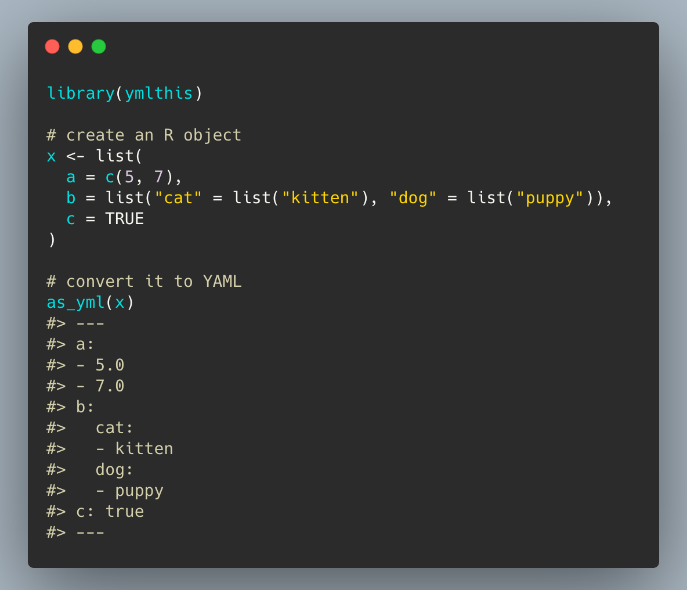

# `codeswitchR`: Code switching in R

This `README` is an attempt to collate a list of packages that may be
helpful for (self-)teaching new programming languages or different
workflows in R. These packages provide a way to convert what one
**knows** and what one may wish to **learn**.

Needless to say, none of the packages can help you *fully* learn a new
programming language, but the idea is to have a starting point that is
**familiar** and **comfortable**, which would hopefully minimize the
chances that you just give up in the early phase when the learning curve
is steep.

------------------------------------------------------------------------

This is in no way a complete list and I would appreciate if more
resources are added. Feel free to [pull
requests](https://github.com/IndrajeetPatil/codeswitchR) for the same. 😊

------------------------------------------------------------------------

# Switch it up 🔀

| What you know  | What you would like to learn | Translator 📦                                                                                              | Examples                                                 |
|----------------|------------------------------|-----------------------------------------------------------------------------------------------------------|----------------------------------------------------------|
| `dplyr`        | `data.table`                 | [`dtplyr`](https://dtplyr.tidyverse.org/articles/translation.html)                                        |  |
| `dplyr`        | `SQL`                        | [`dbplyr`](https://dbplyr.tidyverse.org/articles/sql.html)                                                |        |
| `SQL`          | `dplyr`                      | [`tidyquery`](https://github.com/ianmcook/tidyquery/blob/master/README.md)                                |         |
| `LaTeX`        | `R`/`plotmath`               | [`latex2exp`](https://cran.r-project.org/web/packages/latex2exp/vignettes/using-latex2exp.html)           |   |
| `R`/`plotmath` | `LaTeX`                      | [`simsalapar`](https://rstudio-pubs-static.s3.amazonaws.com/268872_483cb8ee959642b68e9cf2b84eda1e06.html) |   |
| `markdown`     | `LaTeX`, `HTML`, `xml`       | [`commonmark`](https://github.com/r-lib/commonmark)                                                       |    |
| `R`            | `JSON`                       | [`jsonlite`](https://cran.r-project.org/web/packages/jsonlite/vignettes/json-mapping.pdf)                 |           |
| `R`            | `HTML`                       | [`htmltools`](https://rstudio.github.io/htmltools/)                                                       |           |
| `R`            | `YAML`                       | [`ymlthis`](https://ymlthis.r-lib.org/index.html)                                                         |            |

<!-- To create a copy of the `README.html`. -->
<!-- ```{r} -->
<!-- fs::file_copy("README.html", "index.html") -->
<!-- ``` -->
